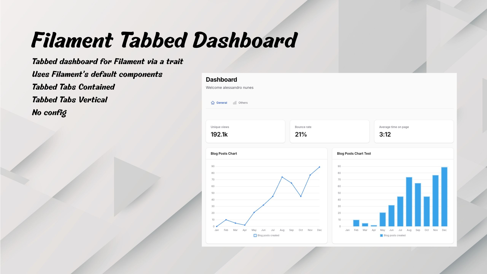

# Filament Tabbed Dashboard

Tabbed dashboard for Filament via a trait. No config; uses Filament’s default components.



## Requirements

- PHP 8.2+
- Laravel 11 or 12
- Filament 4 or 5

## Installation

```bash
composer require alessandro-nuunes/filament-tabbed-dashboard
```

The ServiceProvider is auto-registered. Registering the plugin on the panel is optional.

## Usage

In your Dashboard (e.g. `app/Filament/Admin/Pages/Dashboard.php`):

1. Use the `HasTabbedDashboard` trait.
2. Implement `getTabDefinitions()` with your tabs.

```php
use AlessandroNuunes\FilamentTabbedDashboard\HasTabbedDashboard;
use Filament\Pages\Dashboard;

class Dashboard extends Dashboard
{
    use HasTabbedDashboard;

    public function getTabDefinitions(): array
    {
        return [
            [
                'id'      => 'overview',
                'label'   => 'Overview',
                'icon'    => 'heroicon-o-home',
                'widgets' => [StatsOverview::class],
                'visible' => true,
            ],
            [
                'id'      => 'analytics',
                'label'   => 'Analytics',
                'icon'    => 'heroicon-o-chart-bar',
                'widgets' => [OtherWidget::class],
                'visible' => true,
            ],
        ];
    }
}
```

The trait provides the package view. Optionally extend `AlessandroNuunes\FilamentTabbedDashboard\Pages\TabbedDashboard` and implement only `getTabDefinitions()`.

### Tab structure

| Key            | Required | Description                    |
|----------------|----------|--------------------------------|
| `id`           | yes      | Unique identifier              |
| `label`        | yes      | Tab label                      |
| `widgets`      | yes      | Array of Widget classes        |
| `visible`      | no       | `true` (default) or `false`    |
| `icon`         | no       | Heroicon name                  |
| `badge`        | no       | Number, string, or callable    |
| `badgeColor`   | no       | e.g. `'primary'`, `'warning'`  |
| `badgeTooltip` | no       | Badge tooltip                  |

## Tab appearance (optional)

Override these methods on your Dashboard:

| Method                     | Default     | Effect                              |
|----------------------------|-------------|-------------------------------------|
| `getTabbedTabsContained()` | `false`     | `true` = tabs inside a box          |
| `getTabbedTabsStyle()`     | `'default'` | `'default'`, `'pills'`, or `'boxed'` |
| `getTabbedTabsShowIcons()` | `true`      | `false` = hide icons                |
| `getTabbedTabsVertical()`  | `false`     | `true` = vertical tabs            |

For `pills` or `boxed`, the plugin only adds the CSS class `fi-tabbed-dashboard--{style}`. To change the look, add CSS in your theme (e.g. `resources/css/filament/admin/theme.css`). Without that CSS, tabs use Filament’s default style.

## License

MIT.
